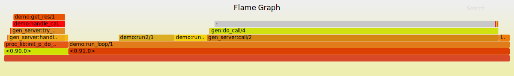
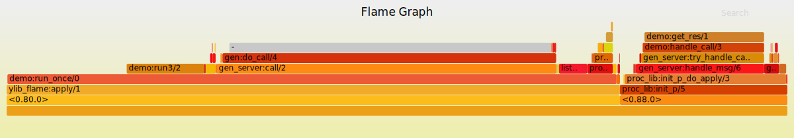

# ylib
erlang工具

ylib_flame
----
生成火焰图工具，注意性能影响，生产环境慎用
可以对单个函数的执行，或者运行中的进程进行分析，

> 函数分析 ylib_flame:apply({M, F, A}).  
> 
> ylib_flame:apply({io, format, ["~3p", [123456]]})  
>

> %% 进程分析 ylib_flame:start([RuningPid]).  
> 
> ylib_flame:start([code_server]).  
> code:add_path(".").  
> ylib_flame:stop().
>

执行成功后，会提示：  
writing:Your/Path/stacks_XXX.out, Count  
run script to dump svg  
./stack_to_flame.sh  Your/Path/stacks_XXX.out  
安装了perl直接执行即可

demo
---
    %% demo.erl
    t() ->
        trace函数
        ylib_flame:apply({?MODULE, run_once, []}),
        %% trace运行中进程
        {ok, Server} = demo:start_link(),
        Pid = erlang:spawn(?MODULE, run_loop, [Server]),
        ylib_flame:start([Pid,Server]),
        timer:sleep(500),
        ylib_flame:stop(),
        Pid ! stop,
        ok.

> demo:t()
> 

其它
--- 
灰色部分为调用gen_server:call的等待时间